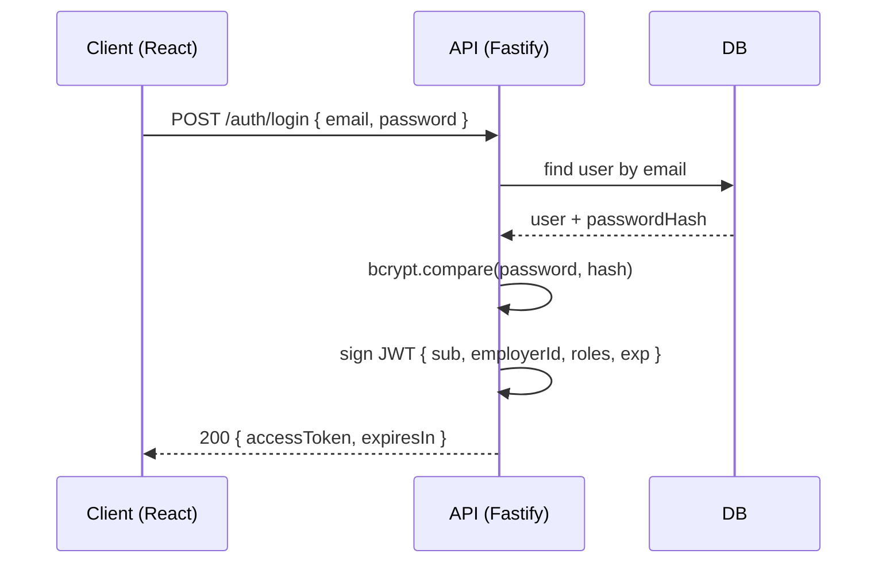
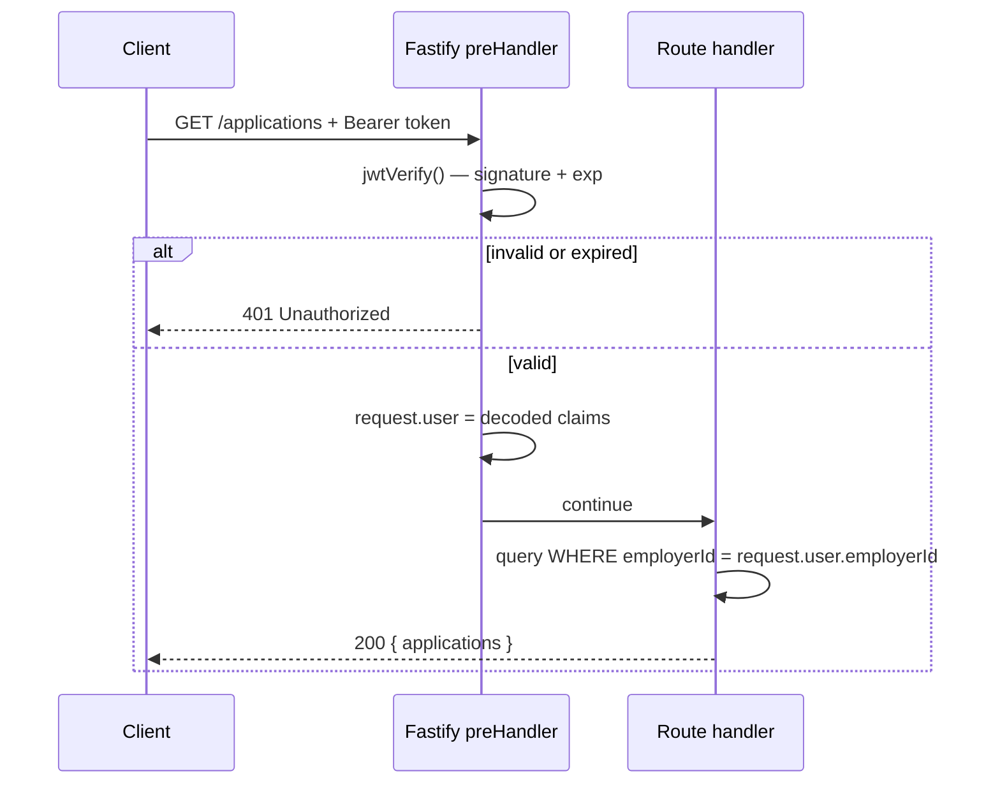

# How does JWT authentication work?

**Target time:** 60–90 seconds (flow version — rehearse the spine, not every step)

---

## Talk track

> **JWT** = signed JSON blob the client sends on every request so the server knows **who you are** without looking up a session every time (stateless).
>
> **Three parts:** `header` (algorithm) · `payload` (claims) · `signature` (proves server issued it, not tampered).
>
> **Claims you care about:** `sub` (user id), `employerId` (tenant), `roles`, `exp` (expiry), `iat` (issued at).
>
> **Important:** JWT is **signed**, not encrypted — anyone can base64-decode the payload. Don't put passwords or PII you wouldn't expose.

---

## Flow 1 — Login → get token

```
1. Client  POST /auth/login     { email, password }
2. Server  verify password (bcrypt compare against DB hash)
3. Server  build payload       { sub, employerId, roles, exp }
4. Server  sign with secret    → accessToken (JWT string)
5. Client  stores access token  (memory — see auth/03)
6. Client  optional: refresh token in HttpOnly cookie (see auth/04)
```



---

## Flow 2 — Authenticated API request (every call after login)

```
1. Client  GET /v1/applications
           Header: Authorization: Bearer eyJhbG...
2. Server  preHandler runs BEFORE route handler
3. Server  extract Bearer token from header
4. Server  verify signature (wrong secret / tampered → 401)
5. Server  check exp (expired → 401)
6. Server  attach decoded claims → request.user
7. Handler runs with request.user (employerId, roles, etc.)
8. Response 200 + data (scoped to tenant — see auth/11)
```



---

## Flow 3 — What happens inside `jwtVerify`

```
1. Split token on "." → header | payload | signature
2. Recompute HMAC(header.payload, JWT_SECRET)
3. Compare with signature in token → mismatch = reject
4. Parse payload JSON → check exp > now
5. Trust claims until expiry (no DB hit for basic auth)
```

> **Revocation gap:** if user is fired mid-session, JWT still valid until `exp`. Fix: short TTL + refresh (auth/04), or server-side blocklist for sensitive apps.

---

## Code

```http
POST /v1/auth/login
{ "email": "admin@acme.com", "password": "..." }
→ 200 { "accessToken": "eyJhbG...", "expiresIn": 900 }

GET /v1/applications
Authorization: Bearer eyJhbG...
→ 200 { "data": [...] }
```

```ts
fastify.register(jwt, { secret: process.env.JWT_SECRET });

// Runs on protected routes only
async function authenticate(request, reply) {
  try {
    await request.jwtVerify();
  } catch {
    return reply.status(401).send({ error: "Unauthorized" });
  }
}

fastify.get("/v1/applications", {
  preHandler: [authenticate],
}, async (request) => {
  const { employerId } = request.user as { employerId: string };
  return prisma.application.findMany({ where: { employerId } });
});
```

**JWT payload example:**
```json
{
  "sub": "user_42",
  "employerId": "acme",
  "roles": ["employer_admin"],
  "iat": 1717840800,
  "exp": 1717841700
}
```

---

## How this connects

| Next file | Why |
|-----------|-----|
| `auth/02` | Session cookie is the alternative to Bearer JWT |
| `auth/03` | Where the client keeps `accessToken` |
| `auth/04` | What happens when `exp` passes |
| `auth/11` | How `employerId` in JWT scopes every query |
| `auth/12` | How `roles` in JWT gates actions |

---

## Avoid

- Sensitive data in payload (it's readable — not secret)
- Skipping `preHandler` on "internal" routes that still touch tenant data
- One JWT that lives 30 days with no refresh/revoke story
