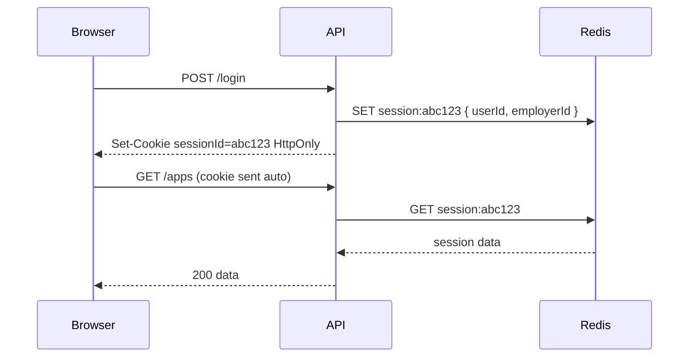

# JWT vs session cookies — tradeoffs?

**Target time:** 60–90 seconds

---

## Talk track

> Two ways to answer "is this user logged in?" on each request. Pick based on **who the client is** (browser SPA vs mobile vs B2B API) and **revocation needs**.

---

## Flow A — Session cookie (server-side session)

```
LOGIN
1. Client  POST /login { email, password }
2. Server  verify credentials
3. Server  create session row in Redis/DB  { sessionId, userId, employerId, expiresAt }
4. Server  Set-Cookie: sessionId=abc123; HttpOnly; Secure; SameSite=Lax
5. Client  browser stores cookie automatically (JS cannot read HttpOnly)

EACH REQUEST
1. Client  GET /applications  (browser auto-attaches cookie)
2. Server  read sessionId from cookie
3. Server  lookup session in Redis  → userId, employerId, roles
4. Server  if missing/expired → 401
5. Handler runs with session data

LOGOUT
1. Client  POST /logout
2. Server  DELETE session from Redis
3. Server  clear cookie
→ instant revoke — next request has no valid session
```



**Pros:** easy revoke, HttpOnly = XSS can't steal token via JS  
**Cons:** Redis/DB lookup every request, need shared session store across API instances

---

## Flow B — JWT Bearer (stateless)

```
LOGIN
1. Client  POST /login
2. Server  verify credentials
3. Server  sign JWT with claims — NO session row
4. Client  stores token (memory / header — see auth/03)
5. Client  sends Authorization: Bearer <jwt> on each request

EACH REQUEST
1. Server  verify signature + exp locally — NO DB
2. Trust claims in payload
3. Handler runs

LOGOUT / REVOKE
→ JWT still valid until exp unless you:
   - use short TTL + refresh token rotation (auth/04), or
   - maintain a server-side denylist (partially defeats stateless)
```

**Pros:** horizontal scale, great for mobile + microservices + B2B APIs  
**Cons:** hard instant revoke, token size in every header

---

## Flow C — Hybrid (what I'd describe for Atlys / modern SPA)

```
LOGIN
→ accessToken (JWT, 15 min) in response body → client keeps in MEMORY
→ refreshToken (opaque or JWT) in HttpOnly cookie

API CALLS
→ Authorization: Bearer <accessToken>

ACCESS EXPIRED
→ silent refresh via cookie (auth/04) → new accessToken in memory

Best of both: stateless short-lived access + revocable refresh in HttpOnly cookie
```

---

## Decision table (say this in interview)

| Scenario | Pick |
|----------|------|
| Browser SPA, need revoke on logout | Hybrid (JWT access + HttpOnly refresh) or session cookie |
| Mobile app | JWT in secure storage + refresh |
| B2B partner integration (server-to-server) | API key or long-lived JWT with rotation policy |
| Microservices | JWT signed with shared secret / JWKS — each service verifies locally |

---

## Code

```ts
// Session cookie
reply.setCookie("sessionId", sid, {
  httpOnly: true,
  secure: true,
  sameSite: "lax",
  maxAge: 60 * 60 * 24 * 7,
});

// JWT Bearer — client sets header manually
Authorization: Bearer eyJhbG...
```

---

## Avoid

- Long-lived JWT in localStorage — XSS steals it, can't revoke (auth/03, auth/08)
- Session cookies without SameSite — CSRF risk (auth/09)
