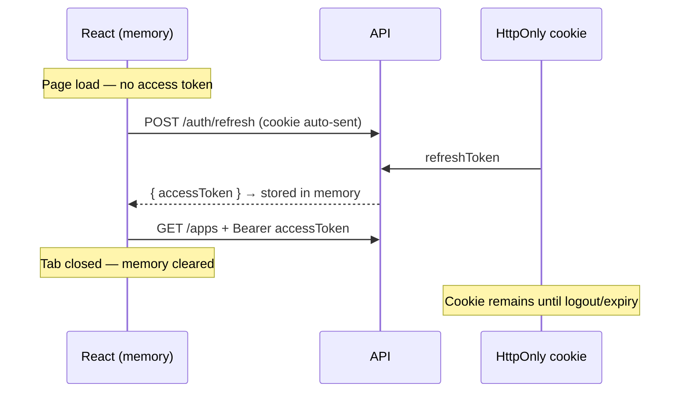

# Where do you store tokens on the frontend?

**Target time:** 60 seconds

---

## Talk track

> The storage choice is a **security tradeoff**: persistence vs XSS resistance.  
> Rule: **the longer a token lives and the more places JS can read it, the worse XSS gets.**

---

## Flow — SPA token lifecycle (recommended pattern)

```
APP LOAD (user already logged in from previous visit)
1. React app mounts — accessToken = null in memory (gone after tab close)
2. App calls POST /auth/refresh  credentials: 'include'  (sends HttpOnly cookie)
3. Browser attaches refreshToken cookie automatically — JS never sees it
4. Server validates refresh token → returns new accessToken in JSON body
5. App stores accessToken in React state / module-level variable (MEMORY)
6. React Query / fetch attaches Authorization: Bearer on API calls

USER WORKS (next 15 min)
7. Every API call uses in-memory accessToken
8. XSS attacker who injects script CAN read memory — but only while tab is open
   (worse than HttpOnly, better than localStorage which persists across sessions)

ACCESS TOKEN EXPIRES
9. API returns 401
10. Interceptor calls /auth/refresh again → new accessToken in memory
11. Retry original request

USER CLOSES TAB
12. accessToken gone from memory
13. refreshToken still in HttpOnly cookie → next visit can silent-refresh

LOGOUT
14. POST /auth/logout  credentials: 'include'
15. Server deletes refresh token from DB + clears cookie
16. Client clears memory accessToken → fully logged out
```



---

## Storage options — flow of what an attacker can do

| Storage | Survives refresh? | JS can read? | XSS steals token? |
|---------|-------------------|--------------|-------------------|
| **Memory** (React state) | No (tab close) | Yes (while open) | Session-only theft |
| **HttpOnly cookie** | Yes | **No** | Can't exfiltrate via JS |
| **localStorage** | Yes | Yes | **Persistent** — worst case |
| **sessionStorage** | Per tab | Yes | Tab-scoped but still bad |

---

## What NOT to do (attack flow)

```
1. Attacker finds XSS (stored comment, reflected query param)
2. Injected script runs: localStorage.getItem('token')
3. Script sends token to attacker server
4. Attacker uses token for days until expiry
→ localStorage + long JWT = game over
```

**Mitigation chain:** memory for access + HttpOnly for refresh + short TTL + CSP (auth/08)

---

## Code

```ts
// ❌ Avoid — persists across sessions, any XSS reads it
localStorage.setItem("accessToken", token);

// ✅ Module-level or React context — lost on tab close
let accessToken: string | null = null;

export function setAccessToken(t: string) { accessToken = t; }
export function getAccessToken() { return accessToken; }

// API client
fetch("/v1/applications", {
  headers: { Authorization: `Bearer ${getAccessToken()}` },
});

// Refresh — cookie handled by browser
fetch("/v1/auth/refresh", { method: "POST", credentials: "include" });
```

```http
# Server sets refresh cookie on login — client JS never touches it
Set-Cookie: refreshToken=opaque_xyz; HttpOnly; Secure; SameSite=Strict; Path=/auth
```

---

## Avoid

- "We use localStorage because it's easy" — explain XSS + persistence risk
- Putting refresh token in localStorage — defeats the whole refresh pattern
