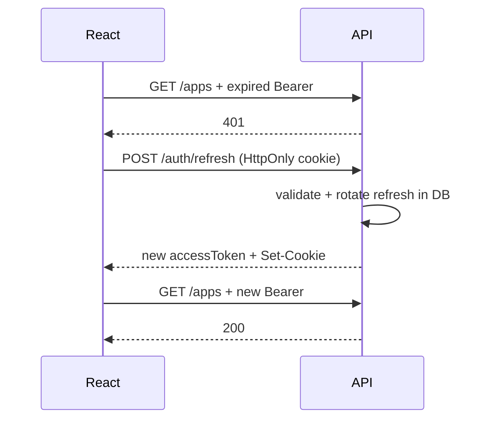

# What is refresh token flow?

**Target time:** 60–90 seconds

---

## Talk track

> **Problem:** short access token (15 min) = secure but annoying if user re-logins constantly.  
> **Solution:** two tokens — **access** (short, used often) + **refresh** (long, used rarely to mint new access tokens).

---

## Flow 1 — Login (issue both tokens)

```
1. Client   POST /auth/login { email, password }
2. Server   verify credentials
3. Server   create accessToken  (JWT, exp = 15 min)
4. Server   create refreshToken (opaque random string OR JWT with typ=refresh, exp = 7 days)
5. Server   HASH refresh token → store in DB  { userId, tokenHash, expiresAt, familyId }
6. Server   response body:     { accessToken, expiresIn: 900 }
7. Server   Set-Cookie:        refreshToken=raw_token; HttpOnly; Secure; SameSite=Strict
8. Client   accessToken → memory (auth/03)
9. Client   refreshToken → browser cookie (JS never sees it)
```

---

## Flow 2 — Normal API usage

```
1. Client   GET /applications  +  Authorization: Bearer <accessToken>
2. Server   jwtVerify → valid → 200
(repeat for 15 minutes)
```

---

## Flow 3 — Access expired → silent refresh (the important part)

```
1. Client   GET /applications  +  Bearer <expired accessToken>
2. Server   jwtVerify → exp passed → 401

3. Client   interceptor catches 401 (only retry ONCE — flag retried=true)
4. Client   POST /auth/refresh   credentials: 'include'
            (browser sends HttpOnly refreshToken cookie)

5. Server   read refresh token from cookie
6. Server   hash it → lookup in DB
7. Server   check: exists? not revoked? not expired?
8. Server   ROTATE: delete old refresh row, insert new refresh token (detects reuse/theft)
9. Server   issue new accessToken + new refresh cookie
10. Server   200 { accessToken, expiresIn }
11. Client   update memory accessToken
12. Client   RETRY original GET /applications with new token → 200
```



---

## Flow 4 — Refresh token stolen / reused (rotation detects theft)

```
1. Attacker steals refresh token (e.g. network sniff without HTTPS — rare if Secure cookie)
2. Attacker uses it → server rotates → new refresh issued to attacker
3. Legit user uses OLD refresh → server sees already-rotated/revoked
4. Server   revoke ENTIRE token family for that user → force re-login everywhere
→ refresh token rotation = breach detection
```

---

## Flow 5 — Logout

```
1. Client   POST /auth/logout  credentials: 'include'
2. Server   delete refresh token row(s) from DB
3. Server   Set-Cookie: refreshToken=; Max-Age=0
4. Client   accessToken = null in memory
→ both tokens dead — instant logout even though access JWT might not be expired yet
   (access still works until exp unless you blocklist — usually acceptable for 15 min)
```

---

## Flow 6 — Refresh expired → full re-login

```
1. Client   POST /auth/refresh
2. Server   refresh token expired or missing → 401
3. Client   redirect to /login
4. User     enters credentials again
```

---

## Code

```ts
// Login handler (simplified)
const accessToken = fastify.jwt.sign(
  { sub: user.id, employerId: user.employerId, roles: user.roles },
  { expiresIn: "15m" },
);
const refreshRaw = randomBytes(32).toString("hex");
await prisma.refreshToken.create({
  data: { userId: user.id, tokenHash: hash(refreshRaw), expiresAt: addDays(7) },
});
reply
  .setCookie("refreshToken", refreshRaw, { httpOnly: true, secure: true, sameSite: "strict" })
  .send({ accessToken, expiresIn: 900 });
```

```ts
// Client interceptor (fetch / axios)
async function apiFetch(url: string, options: RequestInit = {}, retried = false) {
  const res = await fetch(url, {
    ...options,
    headers: { ...options.headers, Authorization: `Bearer ${getAccessToken()}` },
  });
  if (res.status === 401 && !retried) {
    await refreshAccessToken(); // POST /auth/refresh, credentials: include
    return apiFetch(url, options, true);
  }
  return res;
}
```

---

## Token comparison (say clearly)

| | Access token | Refresh token |
|--|--------------|---------------|
| Lifetime | ~15 min | ~7 days |
| Sent how | `Authorization` header | HttpOnly cookie |
| Used for | Every API call | Only `/auth/refresh` |
| Stored client | Memory | Cookie (JS can't read) |
| Stored server | Not stored (stateless JWT) | Hashed in DB |

---

## Avoid

- Same secret + same TTL for both tokens
- Refresh token in localStorage
- Infinite refresh retries on 401 (loop forever)
