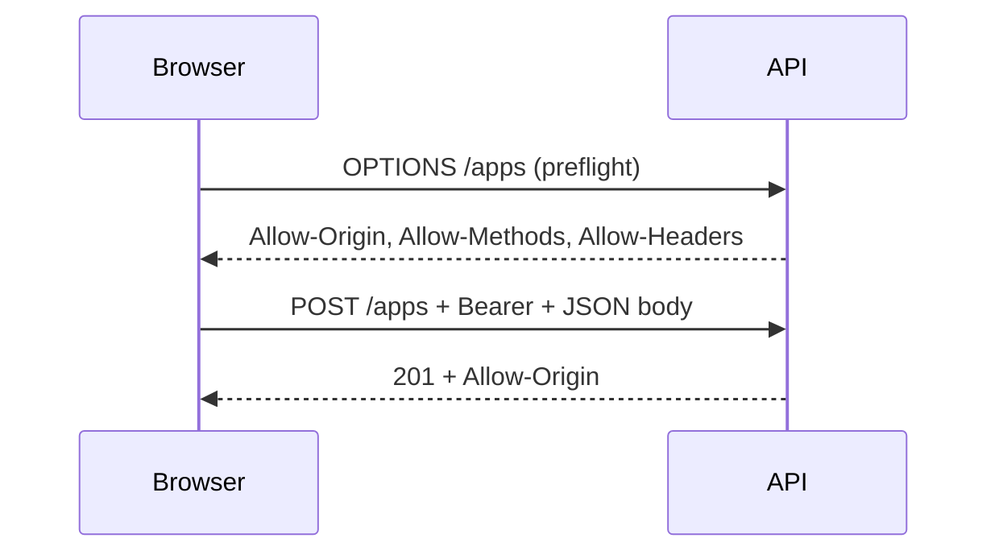

# What is CORS? Why does it exist?

**Target time:** 60 seconds

---

## Talk track

> **CORS** = browser rule, not server security by itself. It stops **evil.com's JavaScript** from **reading** responses from **your API** when the user is on evil.com.
>
> **Key insight:** Postman, curl, mobile apps, server-to-server → **no CORS**. Only browsers enforce it.

---

## Flow 1 — Why CORS exists (attack without CORS protection)

```
WITHOUT CORS (old browsers / same-origin only):
1. User logged into bank.com — session cookie in browser
2. User visits evil.com
3. evil.com JS: fetch('https://bank.com/api/transfer', { credentials: 'include', ... })
4. Browser sends bank.com cookie automatically
5. evil.com reads response → steals balance / confirms transfer
→ browser now blocks reading cross-origin responses unless bank.com allows evil.com
```

---

## Flow 2 — Simple cross-origin request (GET, no custom headers)

```
1. React app at https://app.example.com:5173
2. fetch('https://api.example.com/v1/applications')  — different origin (port/host)
3. Browser adds header:  Origin: https://app.example.com:5173
4. API responds with:    Access-Control-Allow-Origin: https://app.example.com:5173
5. Browser checks match → JS can read response ✅

If API omits Allow-Origin → browser hides response from JS → CORS error in console
(note: request may still HIT server — CORS doesn't block the request, blocks JS reading it)
```

---

## Flow 3 — Preflight (POST with JSON, custom headers, PUT, DELETE)

```
1. Browser sees "non-simple" request (e.g. Content-Type: application/json)
2. Browser FIRST sends OPTIONS (preflight) — no body, no real action

   OPTIONS /v1/applications
   Origin: https://app.example.com
   Access-Control-Request-Method: POST
   Access-Control-Request-Headers: authorization, content-type

3. Server responds:
   Access-Control-Allow-Origin: https://app.example.com
   Access-Control-Allow-Methods: GET, POST, PATCH, DELETE
   Access-Control-Allow-Headers: authorization, content-type
   Access-Control-Allow-Credentials: true   (if using cookies)

4. Browser approves → sends actual POST with Bearer token / cookies
5. Real request gets same Allow-Origin on response
```



---

## Flow 4 — With credentials (cookies / refresh token)

```
1. Client: fetch(url, { credentials: 'include' })
2. Browser sends cookies cross-origin ONLY IF:
   - Server: Access-Control-Allow-Credentials: true
   - Server: Access-Control-Allow-Origin: SPECIFIC origin (NOT *)
3. Same for Set-Cookie on refresh — origin must be whitelisted
→ this is why auth/03 refresh flow and CORS config must align
```

---

## Code

```ts
fastify.register(cors, {
  origin: ["https://app.example.com", "http://localhost:5173"],
  credentials: true,
  methods: ["GET", "POST", "PATCH", "DELETE", "OPTIONS"],
  allowedHeaders: ["Content-Type", "Authorization"],
});
```

```ts
// Frontend — must match credentials: true on server
fetch("https://api.example.com/v1/auth/refresh", {
  method: "POST",
  credentials: "include",
});
```

---

## Avoid

- `Access-Control-Allow-Origin: *` with `credentials: true` — browser rejects it
- Debugging CORS in Postman — it works there; test in real browser
