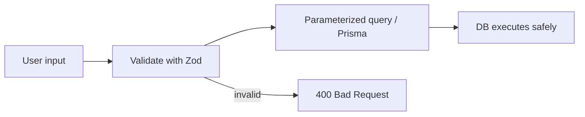

# How do you prevent SQL injection?

**Target time:** 45–60 seconds

---

## Talk track

> **SQL injection** = attacker sends input that **breaks out of your SQL string** and runs their own commands.
>
> This sits **after auth** in the request path — even authenticated users can inject if input isn't parameterized.

---

## Flow 1 — Attack (what goes wrong)

```
1. User submits login:  email = "admin@acme.com' OR '1'='1' --"
2. Vulnerable code builds:
   SELECT * FROM users WHERE email = 'admin@acme.com' OR '1'='1' --'
3. SQL sees OR '1'='1' as always true → returns all users → bypass auth
OR
   email = "'; DROP TABLE users; --"  → destructive if concatenated
```

---

## Flow 2 — Defense (request path through your API)

```
1. Request hits Fastify route
2. VALIDATE input shape (Zod — auth/07)     email must be string, format email
3. PARAMETERIZED query — input is DATA, not SQL code
4. DB executes with bound parameters        $1 = entire malicious string (harmless)
5. ORM (Prisma) does this automatically
6. Return result — never echo raw SQL errors to client (500 generic message)
```



---

## Flow 3 — Prisma / ORM path (your stack)

```
1. await prisma.user.findFirst({ where: { email: request.body.email } })
2. Prisma generates: SELECT ... WHERE email = $1
3. Parameter bound separately — injection string treated as literal email text
4. No match found → null → 401 invalid credentials (not SQL error)
```

---

## Code

```ts
// ❌ Vulnerable — string interpolation
const q = `SELECT * FROM users WHERE email = '${email}'`;

// ✅ Parameterized raw SQL
await db.query("SELECT * FROM users WHERE email = $1", [email]);

// ✅ Prisma (preferred)
const user = await prisma.user.findFirst({ where: { email } });
```

---

## Layered defense (mention in interview)

```
Validate types → Parameterize → Least-privilege DB user (no DROP rights) → No SQL in error responses
```

---

## Avoid

- "We escape single quotes" — fragile; parameters are the fix
- `${userInput}` inside `prisma.$queryRaw` without tagged template
