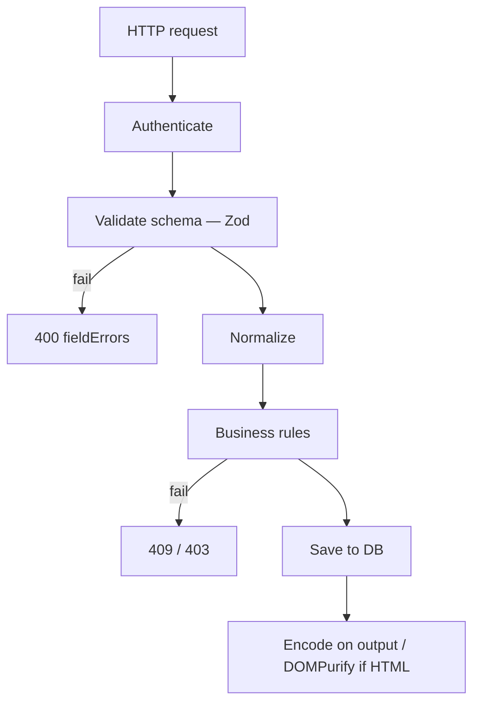

# How do you sanitize user input?

**Target time:** 45–60 seconds

---

## Talk track

> Input hits your system in a **pipeline**. Each layer has a job — don't skip straight to "sanitize everything."

---

## Flow — Request input pipeline (end to end)

```
1. INGRESS — HTTP body / query / headers arrive
2. AUTH    — who is this? (auth/01) — before trusting any body field for tenant scope
3. VALIDATE (reject bad shape)
   - Zod / JSON Schema: type, required fields, max length, email format, enum values
   - Fail fast → 400 with fieldErrors (api/05)
4. NORMALIZE (safe transforms)
   - trim whitespace, lowercase email, parse dates to ISO
5. BUSINESS RULES (reject illegal state)
   - "application already submitted" → 409
   - "employee not in this employer's census" → 403/404
6. PERSIST — store sensible representation (often raw text for names)
7. OUTPUT — escape on render (React JSX) or sanitize HTML (DOMPurify) — auth/08
```



---

## Flow — Validate vs sanitize (when to use which)

```
VALIDATE (reject):
  - UUID, date, enum status, email format
  - "abc" is not a valid date → 400, don't try to "fix" it

SANITIZE (transform):
  - trim(name), toLowerCase(email)
  - strip HTML tags from plain-text bio field

ESCAPE ON OUTPUT (don't destroy input):
  - Store "O'Brien" as-is
  - React renders safely: <p>{name}</p>
  - Don't strip apostrophe on save
```

---

## Flow — File upload (different path)

```
1. Validate: max size, allowed MIME, extension allowlist
2. Stream to S3 — never trust client filename for path
3. Virus scan async job
4. Store metadata row — separate from string sanitization
```

---

## Code

```ts
const CreateApplication = z.object({
  employeeId: z.string().uuid(),
  planId: z.string().min(1),
  coverageTier: z.enum(["employee", "employee_plus_spouse", "family"]),
  notes: z.string().trim().max(500).optional(),
});

// In handler — after authenticate
const body = CreateApplication.parse(request.body);
// Zod throws → map to 400

await prisma.application.create({
  data: {
    ...body,
    employerId: request.user.employerId, // from JWT — NOT from body (auth/11)
  },
});
```

---

## Avoid

- Blacklist sanitization (`replace('<script>', '')`) — bypassable
- Trusting `employerId` from request body when JWT already has it
