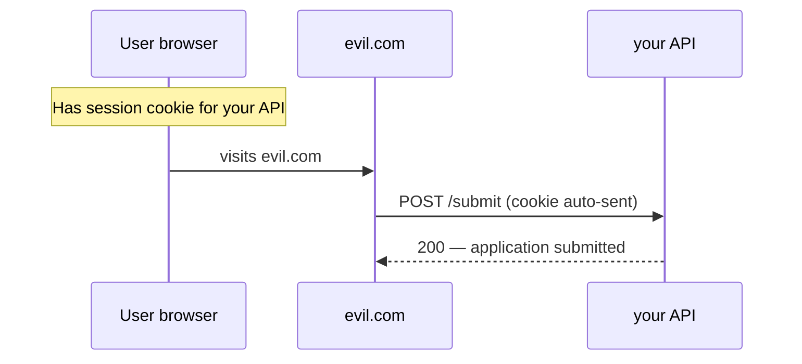

# What is CSRF?

**Target time:** 60 seconds

---

## Talk track

> **CSRF** = attacker tricks **your browser** into sending a **authenticated request** the user didn't intend.
>
> **Only applies when:** browser **automatically attaches auth** (cookies) — not when you manually set `Authorization: Bearer` header.

---

## Flow 1 — CSRF attack (cookie-based auth)

```
SETUP
- User logged into app.example.com — session cookie in browser

ATTACK
1. User visits evil.com (phishing email, ad, forum post)
2. evil.com page contains:
   <form action="https://api.example.com/v1/applications/42/submit" method="POST">
   <input type="hidden" name="confirm" value="true">
   </form>
   <script>document.forms[0].submit()</script>
   OR: fetch('https://api.example.com/...', { method: 'POST', credentials: 'include' })

3. Browser automatically attaches app.example.com session cookie
4. Server sees valid session → submits application as victim
5. User never knew — no XSS needed on your site
```



---

## Flow 2 — Why Bearer JWT is lower CSRF risk

```
1. accessToken lives in JavaScript memory (auth/03)
2. evil.com fetch() cannot read your memory or set Authorization header
   from a cross-origin context with your token
3. Browser does NOT auto-attach Bearer tokens like cookies
→ CSRF mainly a problem for session-cookie OR refresh-cookie-only auth patterns
```

> **Note:** refresh token in HttpOnly cookie on `POST /auth/refresh` — scope that endpoint narrowly; SameSite=Strict helps.

---

## Flow 3 — Defenses (pick by auth model)

```
IF SESSION COOKIE AUTH:

Defense A — SameSite cookie
  Set-Cookie: session=...; SameSite=Strict
  → browser won't send cookie on cross-site POST from evil.com

Defense B — CSRF token (double-submit)
  1. Server sets cookie: csrfToken=random (readable by JS)
  2. SPA reads csrfToken, sends header: X-CSRF-Token: random on mutating requests
  3. Server compares header vs cookie — evil.com can't read your cookies cross-origin
     (actually evil can't read HttpOnly; for CSRF token use non-HttpOnly cookie OR meta tag)

Defense C — Custom header
  X-Requested-With: XMLHttpRequest
  → cross-origin simple requests can't set custom headers without preflight approval

Defense D — Verify Origin / Referer on POST/PATCH/DELETE
```

---

## Flow 4 — Your hybrid auth model (JWT + refresh cookie)

```
Mutating API calls  → Authorization: Bearer (memory)  → CSRF not applicable
Refresh endpoint    → HttpOnly cookie only            → SameSite=Strict + narrow Path=/auth
Login/logout        → same cookie rules
```

---

## Code

```ts
reply.setCookie("session", sid, {
  httpOnly: true,
  secure: true,
  sameSite: "strict", // blocks cross-site cookie on POST
});

// SPA with cookie session — add CSRF header on mutations
fetch("/v1/applications/42/submit", {
  method: "POST",
  credentials: "include",
  headers: { "X-CSRF-Token": getCsrfFromCookie() },
});
```

---

## Avoid

- Session cookies with `SameSite=None` without understanding CSRF
- Ignoring CSRF because "we have JWT" while refresh/login still use cookies unsafely
