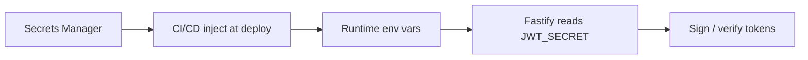

# How do you handle secrets in code?

**Target time:** 45–60 seconds

---

## Talk track

> Secrets power auth — `JWT_SECRET`, DB URL, API keys. Leak = forge tokens, read all data.

---

## Flow 1 — Local development

```
1. Copy .env.example → .env  (placeholders only in example)
2. .env in .gitignore — never committed
3. App boot: validate required secrets exist (fail fast)
   if (!process.env.JWT_SECRET) throw new Error('JWT_SECRET required')
4. Developer uses own local secrets — not prod values
```

---

## Flow 2 — CI/CD → production deploy

```
1. Secrets stored in AWS Secrets Manager / Parameter Store / GitHub Actions secrets
2. CI pipeline injects at deploy time:
   - ECS task definition env vars
   - Lambda environment
   - K8s secrets mounted as files
3. Docker image built WITHOUT secrets baked in
   (layers are inspectable — never ARG JWT_SECRET in Dockerfile for prod)
4. App container starts → reads env → signs JWTs / connects DB
5. Rotate: update secret manager → rolling deploy → old secret invalid after cutover
```



---

## Flow 3 — JWT secret leak response

```
1. Secret exposed in git commit / log / Slack
2. IMMEDIATE: rotate JWT_SECRET in secret manager
3. Deploy all API instances with new secret
4. All existing access tokens invalid at next verify → users refresh or re-login
5. Revoke all refresh tokens in DB (force full re-auth if breach is serious)
6. Audit git history — gitleaks / GitHub secret scanning
7. Post-mortem: how did it leak, prevent recurrence
```

---

## Flow 4 — Least privilege (related)

```
App DB user     → SELECT/INSERT/UPDATE on app tables only — no DROP SCHEMA
App IAM role    → S3 bucket for uploads only — not admin AWS
JWT signing key → only on API servers — not on frontend build
```

---

## Code

```ts
// Boot validation (node/09 pattern)
const required = ["JWT_SECRET", "DATABASE_URL"] as const;
for (const key of required) {
  if (!process.env[key]) throw new Error(`${key} is required`);
}

const jwtSecret = process.env.JWT_SECRET!; // never hardcode
```

```gitignore
.env
.env.local
.env.*.local
*.pem
```

```dockerfile
# ❌ Don't bake secrets
# ENV JWT_SECRET=abc123

# ✅ Inject at runtime via orchestrator
```

---

## Avoid

- Secrets in frontend bundle (VITE_JWT_SECRET — exposed to everyone)
- Same JWT secret across dev and prod
