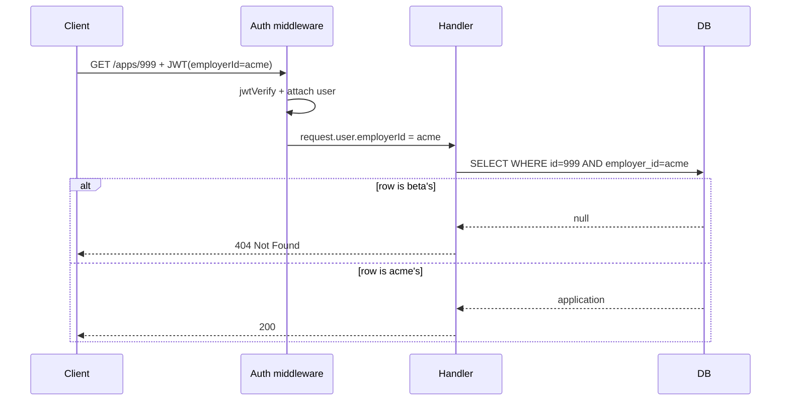

# Multi-tenant auth — how do you isolate tenants?

**Target time:** 90 seconds (whiteboard-friendly)

---

## Talk track

> **Example:** Acme Corp and Beta Inc share the same API and DB. **Acme must never see Beta's applications.**  
> Tenant isolation is enforced **on every request**, not just at login.

---

## Flow — Full request from JWT to DB (the whole chain)

```
1. REQUEST ARRIVES
   GET /v1/applications/app_999
   Authorization: Bearer eyJ...

2. AUTHENTICATE (auth/01)
   jwtVerify → request.user = { sub: 'user_1', employerId: 'acme', roles: ['employer_admin'] }

3. EXTRACT TENANT FROM TOKEN — NEVER FROM URL/BODY ALONE
   const tenantId = request.user.employerId   // 'acme'
   ❌ const tenantId = request.body.employerId  // attacker can spoof

4. AUTHORIZE (auth/12)
   Does this role allow 'application:read'?

5. QUERY WITH TENANT SCOPE
   prisma.application.findFirst({
     where: { id: 'app_999', employerId: tenantId }  // BOTH id AND tenant
   })

6. OUTCOME
   - Row exists for acme     → 200 + data
   - Row exists for beta only → null → 404 (not 403 — don't leak existence)
   - No row                  → 404

7. LIST ENDPOINTS — same rule
   findMany({ where: { employerId: tenantId } })  // always filter lists
```



---

## Flow — Attack you're preventing

```
1. Attacker (acme admin) guesses: GET /v1/applications/beta_app_123
2. WITHOUT tenant filter: returns Beta's PII → breach
3. WITH tenant filter: WHERE id=beta_app_123 AND employer_id=acme → no row → 404
```

---

## Flow — Belt-and-suspenders (Postgres RLS)

```
1. On each DB connection, set: SET app.employer_id = 'acme'
2. RLS policy: USING (employer_id = current_setting('app.employer_id'))
3. Even if developer forgets WHERE clause, DB blocks cross-tenant reads
→ mention as "defense in depth" — don't rely on RLS alone without app-level checks
```

---

## Flow — Other resources (same pattern)

```
S3:     s3://bucket/acme/uploads/...     — prefix per tenant
Queues: message attribute employerId=acme — consumer filters
Cache:  redis key acme:applications:list  — namespace keys
Logs:   structured log { employerId: 'acme' } — never log cross-tenant in same trace
```

---

## Code

```ts
// JWT claims — tenant is authoritative
{ "sub": "user_1", "employerId": "acme", "roles": ["employer_admin"] }

// Single resource
const app = await prisma.application.findFirst({
  where: {
    id: request.params.id,
    employerId: request.user.employerId, // always from token
  },
});
if (!app) return reply.status(404).send({ error: "Not found" });

// Create — force tenant from token, ignore body
await prisma.application.create({
  data: {
    ...validatedBody,
    employerId: request.user.employerId,
  },
});
```

```sql
ALTER TABLE applications ENABLE ROW LEVEL SECURITY;
CREATE POLICY tenant_isolation ON applications
  USING (employer_id = current_setting('app.employer_id', true));
```

---

## Testing flow (mention briefly)

```
1. Seed acme app + beta app
2. Login as acme user → GET beta's app id → expect 404
3. Login as acme user → list applications → only acme rows
```

---

## Avoid

- `GET /applications/:id` with only `where: { id }` — missing tenant
- Trusting `employerId` from request body on create
