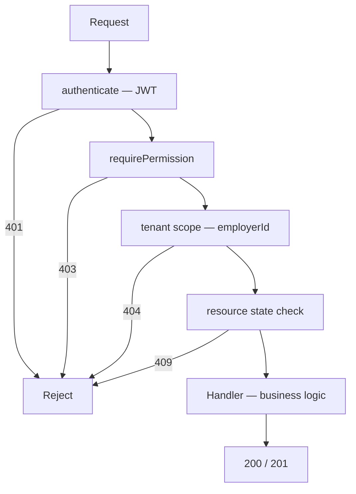

# Role-based access control — how would you implement?

**Target time:** 90 seconds

---

## Talk track

> **Auth** answers *who are you?* (JWT/session)  
> **RBAC** answers *what are you allowed to do?* (roles → permissions)  
> Both run **server-side** on every mutating request.

---

## Flow — Full middleware chain (order matters)

```
REQUEST: POST /v1/applications/42/submit

Step 1 — authenticate (auth/01)
  → jwtVerify → request.user = { sub, employerId: 'acme', roles: ['employer_viewer'] }

Step 2 — requirePermission('application:submit')  (THIS FILE)
  → employer_viewer has ['application:read'] only
  → 'application:submit' NOT in list → 403 Forbidden — STOP

--- if role were employer_admin ---

Step 2 — requirePermission('application:submit')
  → employer_admin has submit → PASS

Step 3 — tenant scope (auth/11)
  → load application WHERE id=42 AND employerId='acme'
  → not found → 404

Step 4 — resource-level / state check
  → status must be 'draft' to submit
  → already 'submitted' → 409 Conflict

Step 5 — handler executes submit logic
  → update status, emit event, return 200
```



---

## Flow — Roles → permissions mapping (The company example)

```
employer_admin:
  application:read, application:write, application:submit
  employee:read, employee:write
  census:import

employer_viewer:
  application:read
  employee:read

carrier_ops:
  application:read (assigned employers only)
  quote:read, quote:approve

platform_admin:
  * (internal — audit logged, separate auth realm)
```

```
JWT carries roles: ["employer_admin"]
Server maps role → permission set (code constant or DB table)
Check: does any role grant the required permission?
```

---

## Flow — Where roles come from

```
OPTION A — roles in JWT claims (fast)
  Login → roles embedded in token
  Pro: no DB lookup per request
  Con: role change doesn't apply until token expires → keep access TTL short

OPTION B — DB lookup after auth (fresh)
  jwtVerify → sub → SELECT roles FROM user_roles WHERE user_id = sub
  Pro: instant role revocation
  Con: DB hit every request

HYBRID (common):
  roles in JWT for most checks + short TTL + refresh
  OR critical actions re-check DB
```

---

## Flow — UI vs server (interview must-say)

```
React: hide Submit button if !canSubmit  → UX only
Server: requirePermission('application:submit')  → ACTUAL enforcement

Attacker bypasses UI with curl → server still 403
```

---

## Code

```ts
const PERMISSIONS = {
  employer_admin: [
    "application:read", "application:write", "application:submit",
    "employee:read", "employee:write",
  ],
  employer_viewer: ["application:read", "employee:read"],
  carrier_ops: ["application:read", "quote:read", "quote:approve"],
} as const;

function requirePermission(permission: string) {
  return async (request: FastifyRequest, reply: FastifyReply) => {
    const roles = (request.user as { roles: string[] }).roles;
    const allowed = roles.some((role) =>
      PERMISSIONS[role as keyof typeof PERMISSIONS]?.includes(permission as never),
    );
    if (!allowed) {
      return reply.status(403).send({ error: "Forbidden", code: "INSUFFICIENT_PERMISSION" });
    }
  };
}

fastify.post("/v1/applications/:id/submit", {
  preHandler: [
    authenticate,
    requirePermission("application:submit"),
  ],
}, async (request, reply) => {
  const app = await prisma.application.findFirst({
    where: { id: request.params.id, employerId: request.user.employerId },
  });
  if (!app) return reply.status(404).send({ error: "Not found" });
  if (app.status !== "draft") {
    return reply.status(409).send({ error: "Already submitted" });
  }
  // ... submit logic
});
```

---

## Audit flow (one line for senior IC)

```
Log: { action: 'application.submit', userId, employerId, applicationId, allowed: true/false }
→ denied attempts and sensitive actions traceable
```

---

## Avoid

- Role check only in React
- 403 when cross-tenant (use 404 — auth/11) vs 403 when same tenant but wrong role
