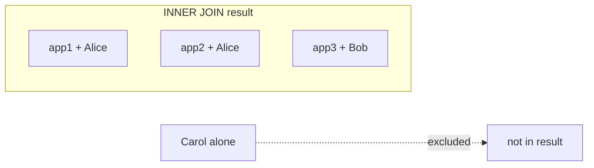

# Explain JOIN types briefly.

**Target time:** 90 seconds (elaborated — know INNER + LEFT cold; others awareness)

---

## Talk track (30-second spine)

> **JOIN** = combine rows from two tables using a **related key** (`applications.employee_id = employees.id`).
>
> Think: **which rows do I keep when there's no match on the other side?**
> - **INNER** — drop both sides if no match  
> - **LEFT** — keep all left rows; fill NULL on right if no match  
> - **RIGHT / FULL** — same idea, other combinations (rare in day-to-day SQL)

---

## Sample data (B2B SaaS-style)

**employees**

| id | name   | employer_id |
|----|--------|-------------|
| e1 | Alice  | acme        |
| e2 | Bob    | acme        |
| e3 | Carol  | acme        |

**applications**

| id   | employee_id | status    |
|------|---------------|-----------|
| app1 | e1            | submitted |
| app2 | e1            | draft     |
| app3 | e2            | submitted |

> **Note:** Carol (e3) has **no** application. Bob has one. Alice has **two**.

---

## Flow — what each JOIN actually does

```
Step 0: Start with two tables side by side
Step 1: Match rows where ON condition is true (employee_id = id)
Step 2: Decide what to do with UNMATCHED rows (that's the JOIN type)
```

---

## INNER JOIN — "only rows that exist on BOTH sides"

**Question it answers:** *"Show me applications **with** their employee name."*  
Applications without a valid employee are dropped. Employees with zero apps never appear.

```
Match pairs:
  app1 ↔ e1 (Alice)
  app2 ↔ e1 (Alice)
  app3 ↔ e2 (Bob)

Carol (e3)     → not in result (no application)
orphan app     → dropped if employee_id invalid
```

**Result (3 rows):**

| app_id | status    | employee_name |
|--------|-----------|---------------|
| app1   | submitted | Alice         |
| app2   | draft     | Alice         |
| app3   | submitted | Bob           |

```sql
SELECT a.id, a.status, e.name AS employee_name
FROM applications a
INNER JOIN employees e ON e.id = a.employee_id
WHERE a.employer_id = 'acme';
-- or filter employer on employees: e.employer_id = 'acme'
```

**When to use:** detail views, list pages where child **must** exist (every application has an employee).



---

## LEFT JOIN — "keep ALL left rows; attach right if found"

**Question it answers:** *"Show me **all employees**, and their applications if any — including employees with zero apps."*

```
Start from employees (LEFT table) → keep every employee row
Attach application columns where match exists, else NULL
```

**Result (4 rows — Carol included with NULL app columns):**

| employee | app_id | status    |
|----------|--------|-----------|
| Alice    | app1   | submitted |
| Alice    | app2   | draft     |
| Bob      | app3   | submitted |
| Carol    | NULL   | NULL      |

```sql
SELECT e.name, a.id AS app_id, a.status
FROM employees e
LEFT JOIN applications a ON a.employee_id = e.id
WHERE e.employer_id = 'acme';
```

**Classic pattern — count per employee including zeros:**

```sql
SELECT e.name, COUNT(a.id) AS app_count
FROM employees e
LEFT JOIN applications a ON a.employee_id = e.id
WHERE e.employer_id = 'acme'
GROUP BY e.id, e.name;

-- Alice → 2, Bob → 1, Carol → 0
```

**When to use:** census coverage ("who hasn't enrolled yet?"), dashboards, optional relations.

---

## RIGHT JOIN — "keep ALL right rows"

Same as **LEFT JOIN but tables swapped**. Rarely written — most people flip table order and use LEFT.

```sql
-- These are equivalent:
FROM employees e LEFT JOIN applications a ON ...
FROM applications a RIGHT JOIN employees e ON ...
```

**Interview line:** *"I practically never use RIGHT JOIN — I reorder tables and use LEFT."*

---

## FULL OUTER JOIN — "keep everything from both sides"

**Question it answers:** *"Show all employees AND all applications, matched where possible, NULLs elsewhere."*

```
Alice + apps, Bob + app, Carol alone (NULL apps)
+ any orphan application with bad employee_id would appear with NULL employee
```

**Postgres supports it;** MySQL historically didn't. Used for data reconciliation, migrations, audit diffs — not typical API queries.

```sql
SELECT e.name, a.id AS app_id
FROM employees e
FULL OUTER JOIN applications a ON a.employee_id = e.id
WHERE e.employer_id = 'acme' OR a.employer_id = 'acme';
```

---

## Decision table (say this in interview)

| You need… | JOIN |
|-----------|------|
| Applications with employee details | **INNER** |
| All employees + optional app data | **LEFT** |
| Count/group including "zero" rows | **LEFT** + `COUNT(a.id)` |
| Reconcile two tables, find orphans both sides | **FULL OUTER** |
| Daily API work | **INNER** or **LEFT** — that's 95% |

---

## Prisma mapping

```ts
// INNER-like — employee is REQUIRED on Application (FK not optional)
await prisma.application.findMany({
  where: { employerId: "acme" },
  include: { employee: { select: { name: true } } },
});
// SQL: FROM applications INNER JOIN employees ...

// LEFT-like — optional relation (employee might be null on model)
// Or: start from employees and include applications
await prisma.employee.findMany({
  where: { employerId: "acme" },
  include: { applications: true },
});
// SQL: FROM employees LEFT JOIN applications ...
// Carol returned with applications: []
```

> **Prisma gotcha:** `include` on a **required** relation won't give you "employees with no apps" — query **from** `employee` with `include: { applications: true }` instead.

---

## Common mistakes

### 1. Cartesian product (missing ON)

```sql
-- ❌ Every application × every employee — explosion
SELECT * FROM applications, employees;

-- ✅
SELECT * FROM applications a
INNER JOIN employees e ON e.id = a.employee_id;
```

### 2. LEFT JOIN but filter right table in WHERE (turns into INNER)

```sql
-- ❌ Looks like LEFT JOIN but WHERE kills NULL rows → acts like INNER
SELECT e.name, a.status
FROM employees e
LEFT JOIN applications a ON a.employee_id = e.id
WHERE a.status = 'submitted';   -- Carol dropped!

-- ✅ Filter optional side in ON, or use subquery
LEFT JOIN applications a
  ON a.employee_id = e.id AND a.status = 'submitted';
```

### 3. Forgetting tenant scope on BOTH sides

```sql
-- ✅ Always scope multi-tenant data (auth/11)
FROM employees e
LEFT JOIN applications a
  ON a.employee_id = e.id AND a.employer_id = e.employer_id
WHERE e.employer_id = 'acme';
```

---

## Interview examples (one-liners)

| Scenario | JOIN |
|----------|------|
| Application list with employee name | INNER |
| "Which census employees haven't started an application?" | LEFT (employees → apps, WHERE app IS NULL) |
| Application with quotes | INNER applications → quotes |
| All quotes including deleted application edge case | LEFT from quotes |

```sql
-- Employees with NO application this enrollment window
SELECT e.id, e.name
FROM employees e
LEFT JOIN applications a
  ON a.employee_id = e.id AND a.enrollment_window_id = '2026-q3'
WHERE e.employer_id = 'acme'
  AND a.id IS NULL;
```

---

## Avoid

- Cartesian product — always explicit `ON`  
- `WHERE right_column = ...` after LEFT JOIN when you meant to keep unmatched left rows  
- RIGHT JOIN in new code — flip tables, use LEFT
