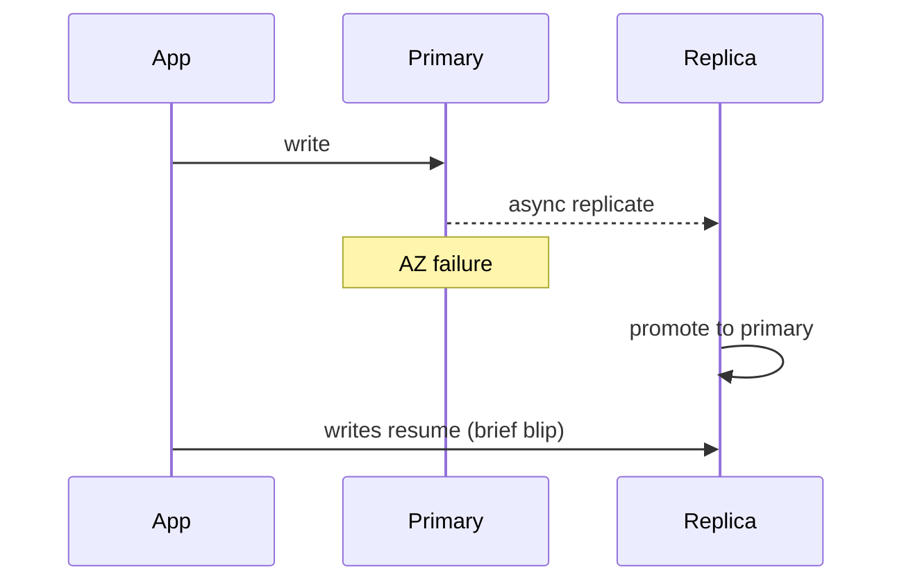

# Replication — why and how?

**Target time:** 90 seconds

---

## Talk track

> **Replication** = copies of data on multiple nodes — for **read scale**, **durability**, and **failover**.
>
> | Style | Pros | Cons |
> |-------|------|------|
> | **Primary + replicas** | Simple writes to one leader | Replica lag, failover complexity |
> | **Multi-leader** | Write locally, low latency | Conflict resolution needed |
> | **Leaderless (quorum)** | High availability | Read repair, stale reads |
>
> **Lag is the killer:** user writes to primary, reads replica → "where did my data go?" Fix: read-your-writes routing, or accept eventual for non-critical reads.
>
> **AWS examples:** RDS read replicas, DynamoDB global tables, S3 cross-region replication.

---

## Failover sketch

---

## How this connects

| File | Why |
|------|-----|
| `databases/14` | Eventual consistency from replication lag |
| `distributed-systems/01` | Consistency model choice |
| `aws/06` | DynamoDB replication model |

---

## Avoid

- Reading from replica for "just written" user flows without lag awareness
- Sync replication everywhere — latency and availability cost
