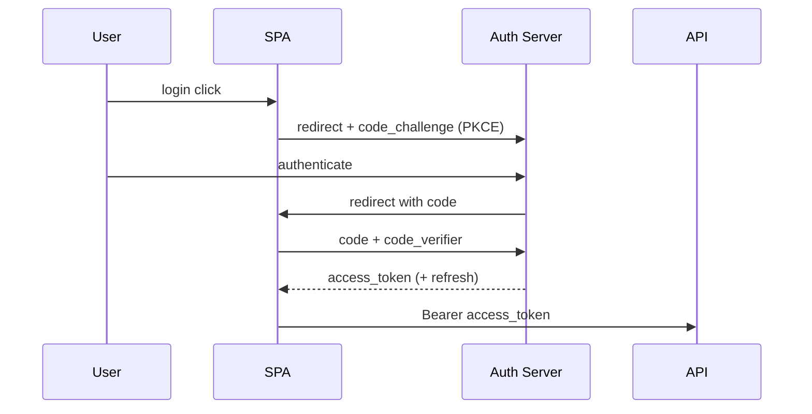

# OAuth2 deep dive — flows and pitfalls

**Target time:** 2–3 min (pick one flow to go deep)

---

## Talk track

> **OAuth2** = **authorization framework** — "App X can access resource Y on behalf of user Z" **without** giving App X the user's password.
>
> **Roles:** Resource owner (user) · Client (your app) · Authorization server (Okta/Auth0/Cognito) · Resource server (API)
>
> **Flows you should know:**

| Flow | Use case | Token delivery |
|------|----------|----------------|
| **Authorization Code + PKCE** | SPAs, mobile, server web apps | Code → exchange for tokens server-side or with PKCE |
| **Client Credentials** | Machine-to-machine, cron jobs | Client ID + secret → access token |
| **Refresh Token** | Long-lived sessions | Rotate refresh tokens; store HttpOnly |

> **Don't use:** Implicit flow (deprecated), Resource Owner Password (legacy only).

---

## Authorization Code + PKCE (modern SPA)

**PKCE** stops stolen authorization codes from being exchanged by an attacker.

---

## Pitfalls

- Storing tokens in `localStorage` on XSS-vulnerable SPA (`auth/03`)
- No `state` param → CSRF on OAuth redirect
- Confusing OAuth2 (authorization) with authentication — that's OIDC (`security-advanced/02`)

---

## How this connects

| File | Why |
|------|-----|
| `auth/01-04` | JWT and refresh after OAuth issues tokens |
| `security-advanced/02` | OIDC adds identity layer on OAuth2 |
| `auth/11` | Tenant scoping after token decode |
