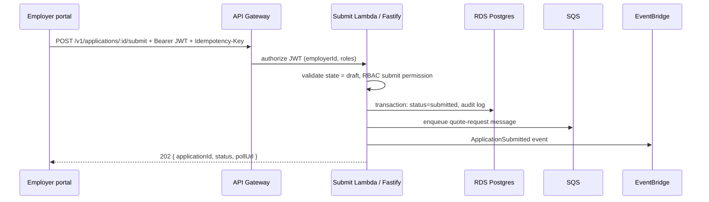

# Design an API for submitting an insurance application.

**Target time:** 10–15 min discussion

---

## Talk track — open with requirements

> **Clarify:**
> - Who submits? Employer admin on behalf of employee (B2B EOI)  
> - Sync response or async (carrier quote takes time)? → **202 + job id**  
> - Multi-tenant — employer scoped (auth/11)  
> - Idempotent submit — `Idempotency-Key` (api/06)

---

## Architecture



---

## API design (api/13)

```http
POST /v1/applications/:id/submit
Authorization: Bearer ...
Idempotency-Key: uuid
→ 202 { "applicationId", "status": "submitted", "pollUrl": "/v1/jobs/job_1" }

GET /v1/applications/:id
→ 200 { status, quotes[], ... }
```

**Rules:**
- `employerId` from JWT — verify application belongs to tenant  
- Command as **POST** not PATCH status alone — business validation in one place  
- **409** if already submitted

---

## Data & async

- **RDS:** application row, audit log (transaction — databases/06)  
- **SQS:** quote worker (aws/07)  
- **DynamoDB:** optional job status for poll endpoint  
- **Idempotency table:** key → cached 202 response

---

## Deep-dive if they ask

| Topic | Answer |
|-------|--------|
| Why 202 not 200? | Carrier quote is async (api/18) |
| Failure on enqueue? | DB transaction rolls back OR outbox pattern |
| Rate limit | Per employer API key / token bucket (node/12) |

---

## Avoid

- Synchronous wait for carrier quote in HTTP handler
