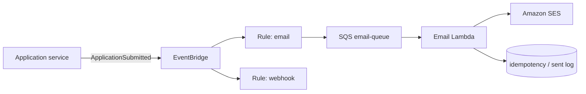

# Design a system to send emails when an event happens.

**Target time:** 8–12 min

---

## Talk track

> **Never send email in the request path** that handled the business action — slow, brittle, blocks user response.
>
> **Pattern:** domain event → async email worker.

---

## Architecture



---

## Flow

```
1. Submit service commits DB → publishes ApplicationSubmitted to EventBridge
2. Rule matches detail-type → target SQS email queue
3. Email worker pulls message
4. Load template + recipient from DB (employer branding)
5. Check idempotency: eventId already sent? → skip
6. SES SendEmail
7. Log sent + delete SQS message
8. On failure → retry → DLQ (aws/11) → alert
```

---

## Components

| Piece | Choice |
|-------|--------|
| Transport | EventBridge or SNS fan-out (aws/10) |
| Queue | SQS buffers spikes, retries |
| Send | **SES** (or SendGrid via API) |
| Templates | DB or S3 HTML + variable substitution |
| Unsubscribe | compliance — store preferences per user |

---

## Deep-dive

- **At-least-once** delivery → idempotent on `eventId` (file 13)  
- **Priority:** transactional (submit confirmation) vs marketing — separate queues  
- **Observability:** CloudWatch metric on DLQ depth, bounce/complaint via SES SNS

---

## Avoid

- `await sendEmail()` inside submit HTTP handler before returning 202
