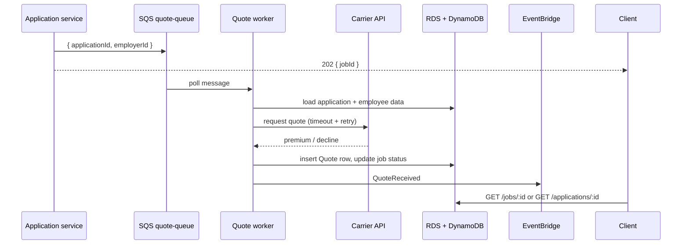

# Design a quote generation flow.

**Target time:** 12–15 min

---

## Talk track

> Carrier pricing is **slow and unreliable** — design as **async job** with status polling or webhook.

---

## Architecture



---

## States

```
pending → calling_carrier → completed | failed | expired
```

Store in DynamoDB `JOB#jobId` for fast poll or RDS `quote_jobs` table.

---

## Resilience

| Risk | Mitigation |
|------|------------|
| Carrier timeout | Retry with backoff (aws/18); max attempts → failed + DLQ |
| Duplicate queue message | Idempotency on `applicationId + requestId` |
| Partial data | Validate before calling carrier; fail fast |
| 15 min Lambda limit | Step Functions for long poll loop (aws/19) |

---

## API surface

```http
POST /v1/applications/:id/request-quote → 202 { jobId, pollUrl }
GET  /v1/jobs/:jobId → { status, quoteId?, error? }
GET  /v1/applications/:id/quotes → list quotes
```

---

## Role-specific angle

> Multiple carriers → parallel workers or fan-out per carrier id in message; aggregate quotes on application.

---

## Avoid

- Blocking HTTP until carrier responds
