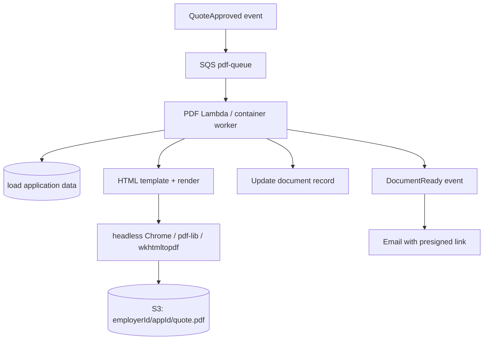

# Design a document (PDF) generation pipeline.

**Target time:** 10–12 min

---

## Talk track

> PDFs (EOI summary, quote letter) are **CPU/memory heavy** — separate **generation pipeline** from API.

---

## Architecture



---

## Flow

```
1. Trigger: application approved OR user clicks "Download PDF"
2. Enqueue { applicationId, documentType, templateVersion }
3. Worker fetches data from RDS (tenant-scoped)
4. Render HTML template with employer branding
5. Convert to PDF (Lambda: watch memory + /tmp size; heavy jobs → Fargate)
6. Upload S3 — SSE-KMS, private bucket
7. Insert documents table: s3Key, checksum, createdAt
8. Notify user — email presigned URL (expires 1h) or in-app download API
```

---

## Design choices

| Choice | When |
|--------|------|
| Lambda | Simple 1–2 page PDFs, < 30s |
| Fargate/ECS worker | Complex layouts, large census attachments |
| Template in git/S3 | Version `templateVersion` for audit |
| Async only | Always — `202 { documentId }` + poll |

---

## Security

- Presigned GET — short TTL (api/14)  
- `employerId` in key path — validate JWT matches (aws/23)  
- Virus scan if user-uploaded merges into PDF

---

## Avoid

- Generating PDF synchronously in submit API
