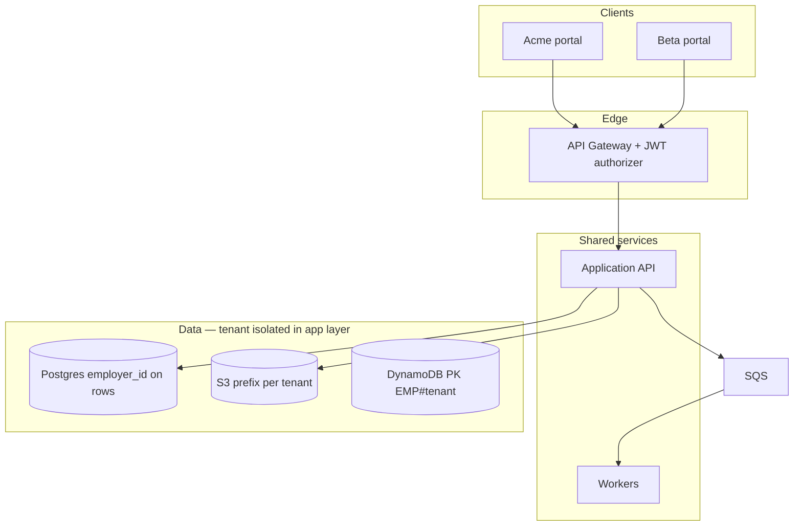

# Design a multi-tenant SaaS backend.

**Target time:** 12–15 min

---

## Talk track

> **Shared stack, logical isolation** — default for B2B SaaS-style B2B (aws/22, auth/11).

---

## Architecture



---

## Isolation layers

1. **Auth** — JWT `employerId` + RBAC (auth/12)  
2. **Every query** — `WHERE employer_id = :tenant`  
3. **S3 keys** — `{employerId}/...`  
4. **Optional RLS** — Postgres belt-and-suspenders  
5. **Rate limits** — per tenant  
6. **Audit logs** — `employerId` on every action

---

## Tenant onboarding

```
POST /internal/tenants → create employer row
→ provision API credentials / Cognito pool
→ default roles, S3 prefix, config
```

---

## When to silo (mention awareness)

- Dedicated AWS account per enterprise carrier — compliance  
- Cost 10x — only when contract requires

---

## Avoid

- Tenant id from request body without JWT match
