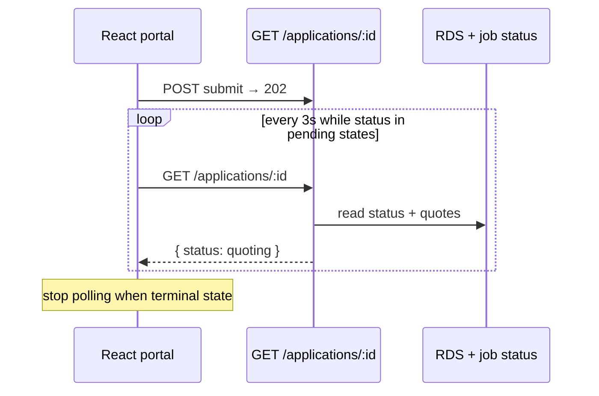

# How would you build a real-time status tracker for an application?

**Target time:** 10–12 min

---

## Talk track

> User submits application — wants to see **submitted → quoting → quoted → approved** without refreshing.

---

## Options (pick based on scale)

| Approach | Pros | Cons |
|----------|------|------|
| **Polling** | Simple, works everywhere | Latency, load |
| **SSE** | One-way server push, HTTP | Connection limits |
| **WebSocket** | Bi-directional | Infra complexity |
| **React Query refetch** | Good enough for B2B | Not truly real-time |

> **Interview default:** start with **polling + React Query** (`refetchInterval` when status pending); upgrade to SSE/WebSocket if product needs sub-second updates.

---

## Architecture (polling — pragmatic)



---

## Architecture (SSE — step up)

```
Client GET /v1/applications/:id/stream (SSE)
→ API Gateway WebSocket or ALB + Fargate Fastify
→ on QuoteReceived event (EventBridge → connection manager)
→ push { status, quoteId } to subscribed clients
```

Store `connectionId` per user in Redis/DynamoDB.

---

## Status source of truth

- **RDS** `applications.status` — canonical  
- **DynamoDB job row** — in-flight worker state  
- UI shows merged view; terminal states stop subscriptions

---

## Avoid

- WebSocket on day one without requirement — over-engineering
