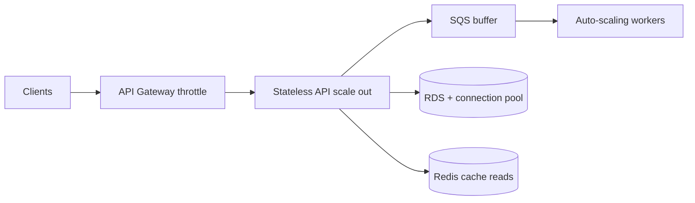

# How would you handle 10x traffic spike?

**Target time:** 10 min

---

## Talk track

> **Enrollment window opens** — 10x submissions in one hour. Layer defenses:

---

## Architecture — absorb spike

---

## Tactics (in order I'd say them)

1. **Queue async work** — accept submit fast, process quotes in workers (aws/07)  
2. **Horizontal scale** — Lambda concurrency / ECS tasks / K8s HPA  
3. **API Gateway throttling** — per-client limits, 429 with Retry-After  
4. **Cache reads** — employer config, plan catalog in Redis (performance-scalability/)  
5. **DB** — connection pooling (PgBouncer), read replicas for dashboards, indexes on hot queries  
6. **CDN** — static assets  
7. **Idempotency** — retries during spike don't duplicate apps  
8. **Load test beforehand** — k6 on submit path, watch RDS connections + queue depth

---

## What breaks first (say proactively)

- DB connections exhausted → pool + limit API concurrency  
- Downstream carrier rate limits → queue + backoff  
- Cold starts on Lambda → provisioned concurrency on submit handler

---

## Avoid

- Scaling only the API while workers stay fixed
