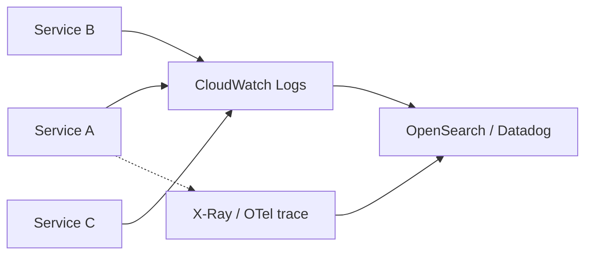

# How would you design logging across 50+ microservices?

**Target time:** 8–10 min

---

## Talk track

> **Goal:** trace one `applicationId` across 50 services — find failure in minutes.

---

## Architecture



---

## Standards (non-negotiable)

```json
{
  "level": "info",
  "msg": "quote_received",
  "requestId": "req_abc",
  "correlationId": "corr_xyz",
  "employerId": "acme",
  "applicationId": "app_42",
  "service": "quote-worker",
  "timestamp": "2026-06-08T12:00:00Z"
}
```

- **`correlationId`** — propagate from API Gateway through SQS message attributes  
- **Structured JSON** — not `console.log("failed")`  
- **Never log** passwords, full SSN, tokens

---

## Three pillars (brief)

| Pillar | Tool |
|--------|------|
| Logs | CloudWatch → OpenSearch/Datadog |
| Metrics | CloudWatch metrics, RED (rate/errors/duration) |
| Traces | X-Ray or OpenTelemetry |

---

## SQS propagation

```ts
// Producer
MessageAttributes: { correlationId: { DataType: "String", StringValue: correlationId } }
// Consumer reads attribute, includes in all logs
```

---

## Avoid

- 50 different log formats — enforce shared library in `packages/logger`
