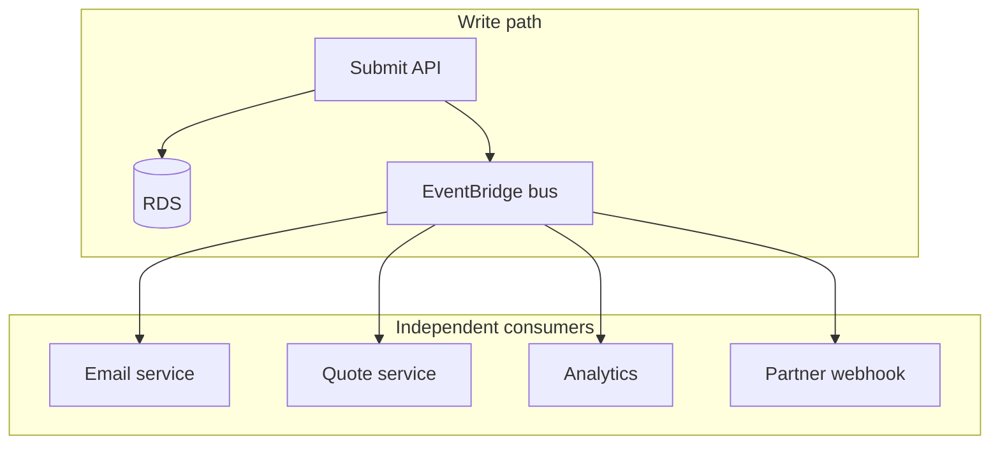

# How would you design an event-driven workflow?

**Target time:** 12–15 min

---

## Talk track

> **Event-driven** = services react to **facts that happened** (`ApplicationSubmitted`) instead of synchronous chains.

---

## Architecture



---

## Event contract

```json
{
  "source": "company.applications",
  "detail-type": "ApplicationSubmitted",
  "detail": {
    "eventId": "evt_uuid",
    "applicationId": "app_42",
    "employerId": "acme",
    "occurredAt": "2026-06-08T12:00:00Z"
  }
}
```

- **Past tense** event names — fact, not command  
- **Minimal payload** — consumers fetch details if needed  
- **Version** field when schema evolves

---

## Patterns

| Pattern | Use |
|---------|-----|
| EventBridge rules | Route by `detail-type` (aws/09) |
| SQS per consumer | Buffer + DLQ per downstream |
| Outbox table | RDS commit + event publish atomic |
| Saga | Distributed rollback — compensating events (e.g. `QuoteFailed` → notify user) |

---

## Outbox (if they ask consistency)

```
Same transaction:
  UPDATE applications SET status = submitted
  INSERT outbox_events (payload, published = false)
Poller publishes to EventBridge → marks published
→ no "saved to DB but event lost"
```

---

## Avoid

- God orchestrator that knows every downstream — prefer loose coupling
