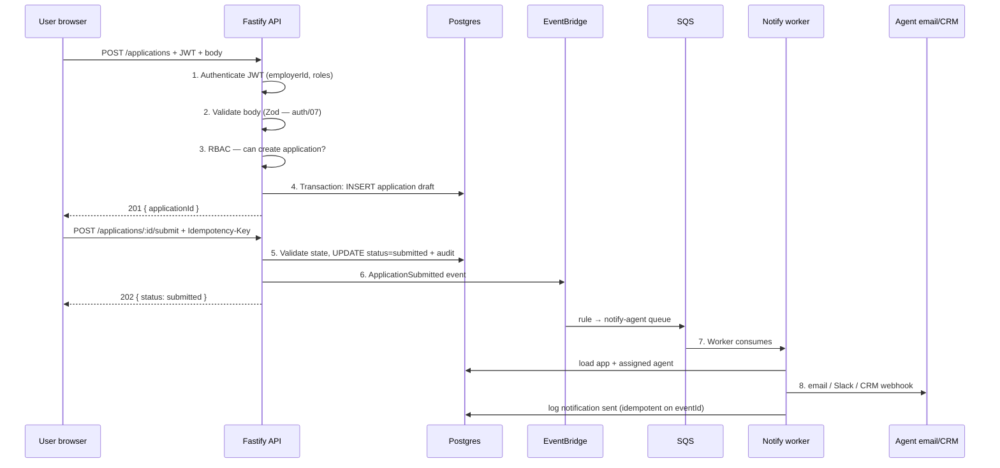

# User submits form → validate → save → notify agent. Walk me through it.

**Target time:** 10–12 min (end-to-end story)

---

## Talk track — narrate step by step

> **Scenario:** Employer admin submits employee enrollment form; agent gets notified.

---

## Flow

---

## Layer breakdown

| Step | Layer | Failure |
|------|-------|---------|
| Validate | API | 400 field errors |
| Auth | API | 401/403 |
| Save | RDS transaction | 500, retry client |
| Notify | Async worker | SQS retry → DLQ |

> **Key point:** user gets **202 after save** — notification is **best-effort async**, not blocking submit.

---

## Atlys parallel

> Visa application submit — same split: sync validate + persist, async notifications and downstream integrations.

---

## Avoid

- Notify agent synchronously before returning response to user
