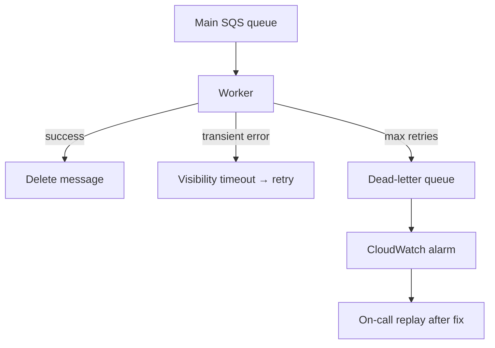

# How do you handle failures in async pipelines?

**Target time:** 8–10 min

---

## Talk track

> Async = **at-least-once** delivery — assume duplicates and partial failures. Design for **recovery**, not perfection on first try.

---

## Failure taxonomy

| Type | Example | Strategy |
|------|---------|----------|
| **Transient** | Carrier 503, network blip | Retry + exponential backoff |
| **Permanent** | Invalid payload, unknown app id | Fail fast → DLQ, alert |
| **Partial** | Email sent, webhook failed | Per-step idempotency + compensating action |
| **Poison** | Bug crashes worker every time | maxReceiveCount → DLQ (aws/11) |

---

## Architecture



---

## Practices

1. **Idempotent handlers** — safe to retry (file 13)  
2. **DLQ + alarms** — never silent loss  
3. **Structured errors** — `{ retryable: true }` in code path  
4. **Circuit breaker** on external APIs — stop hammering carrier  
5. **Manual redrive** from DLQ after deploy fix  
6. **Status visible to user** — job `failed` with reason, not stuck `pending` forever

---

## Code pattern

```ts
try {
  await callCarrier(id);
} catch (e) {
  if (isTransient(e)) throw e; // SQS retries
  await markJobFailed(id, e);  // terminal — don't retry forever
  return; // ack message
}
```

---

## Avoid

- Infinite retries on bad JSON
