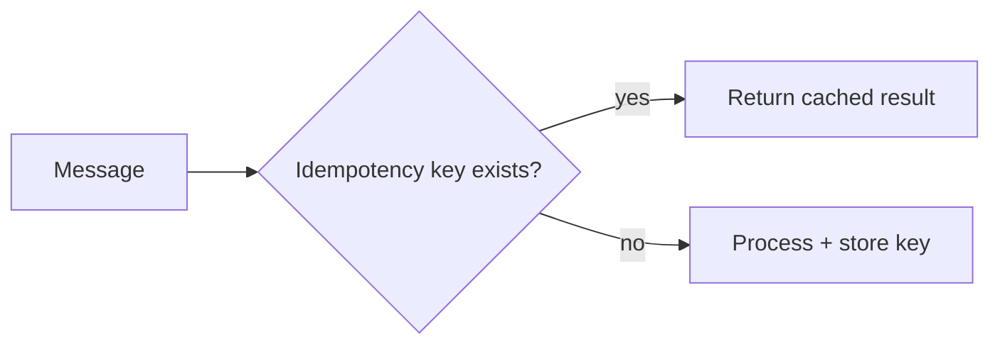

# How do you ensure exactly-once vs at-least-once processing?

**Target time:** 8–10 min

---

## Talk track

> **Truth:** distributed systems → **exactly-once end-to-end is hard**. What we achieve:
> - **At-least-once delivery** (SQS, SNS) + **idempotent consumers** = **effectively once** business outcome

---

## Comparison

| Guarantee | Meaning | AWS example |
|-----------|---------|-------------|
| **At-most-once** | May lose message, never duplicate | Fire-and-forget (rare) |
| **At-least-once** | Never lose, may duplicate | SQS standard |
| **Exactly-once** | Once only | SQS FIFO + dedup id (within 5 min window); Kafka idempotent producer |

---

## Achieve "business exactly-once"

```
1. Producer assigns unique eventId / idempotencyKey
2. Consumer checks dedup store BEFORE side effect:
   DynamoDB: pk=IDEM#key, condition attribute_not_exists
3. Process + commit side effect + record idempotency in SAME logical unit
4. Duplicate delivery → dedup hit → return previous result, no double charge
```



---

## HTTP vs async

- **POST submit** — `Idempotency-Key` header (api/06)  
- **SQS worker** — `messageId` or business `eventId` in DynamoDB  
- **Financial ops** — DB unique constraint `(application_id, action)`

---

## Interview line

> *"I assume at-least-once from the queue and make handlers idempotent — that's how we get exactly-once **effects** without exactly-once **delivery**."*

---

## Avoid

- Claiming SQS standard queue is exactly-once
