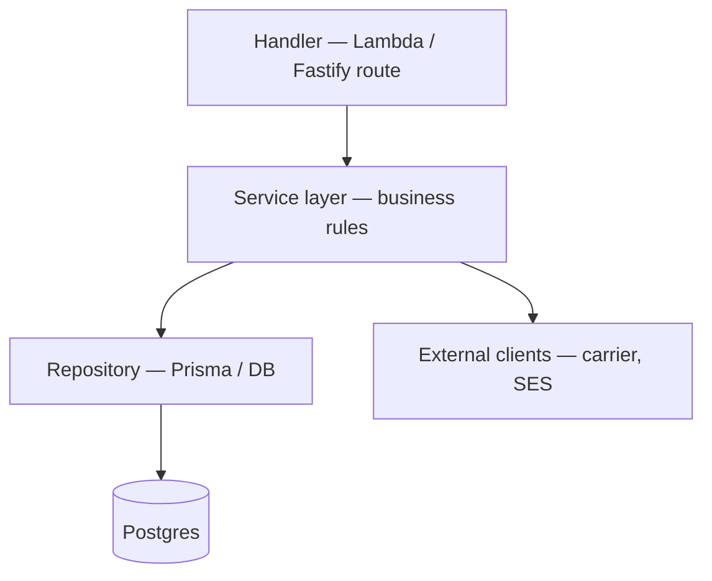

# Where do you put business logic — Lambda, separate service, DB?

**Target time:** 8–10 min

---

## Talk track

> **Rule:** business rules live in **testable domain code** — not scattered in Lambda glue or DB triggers (except simple constraints).

---

## Layering

| Layer | Responsibility |
|-------|----------------|
| **Handler** | Parse event, auth, HTTP status, call service |
| **Service** | "Can submit?", "Calculate eligibility", orchestration |
| **Repository** | Queries, tenant scope |
| **DB** | Constraints, FK, unique indexes — not workflow |

---

## Lambda vs long-running service

| Put in Lambda | Put in Fastify/ECS service |
|---------------|----------------------------|
| Thin trigger, event reaction | Complex REST API, many endpoints |
| Short job (< few min) | Long connections, heavy ORM warm pool |
| Independent scale per function | Shared domain module across routes |

> **Hybrid (Typical setup):** Fastify/ECS for core CRUD API; Lambda for quote worker, email, PDF.

---

## What NOT to put in DB

- Multi-step workflows ("if submitted then call carrier") — app/Step Functions  
- Authorization rules — app layer (auth/12)

## OK in DB

- `CHECK (status IN ('draft','submitted'))`  
- `UNIQUE (employer_id, employee_id, window_id)`  
- FK integrity

---

## Avoid

- 200-line Lambda with all rules inline — extract `services/application.ts`
