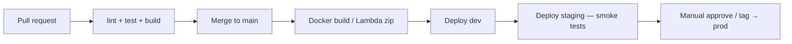

# How do you do CI/CD for microservices?

**Target time:** 8 min

---

## Talk track

> **Per-service pipeline** — change to `quote-service` doesn't deploy `email-service`.

---

## Pipeline (each service)

---

## Practices

- **Monorepo** with path filters — GitHub Actions `paths: quote-service/**`  
- **Shared packages** — internal npm lib versioned  
- **Contract tests** — API schema between services  
- **IaC in same repo** — CDK/Serverless per service  
- **Feature flags** — decouple deploy from release  
- **Database migrations** — run as deploy step, backward compatible (file 20)

---

## Cross-ref

- `cicd-devops/` section for deeper CI/CD answers

---

## Avoid

- One giant deploy script for all 50 services on every commit
